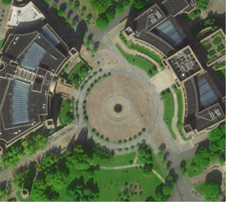

# Plaza Dataset

This dataset comprises images and Inertial Measurement Unit (IMU) data, etc. These sequences recorded at different times (day and night) in an open circular plaza. You can download them using the links below. 

| Sequence | Time | Link |
| --- | --- | --- |
| Plaza1 | Day | [Download](https://pan.baidu.com/s/1v_GN1lRqnEdKcZ4MQCHUog) |
| Plaza2 | Day | [Download](https://pan.baidu.com/s/1v_GN1lRqnEdKcZ4MQCHUog) |
| Plaza3 | Night | [Download](https://pan.baidu.com/s/1v_GN1lRqnEdKcZ4MQCHUog) |
| Plaza4 | Night | [Download](https://pan.baidu.com/s/1v_GN1lRqnEdKcZ4MQCHUog) |

## Sensor Details

*(The download link and the sensor details will be updated upon acceptance of the associated research paper. Please stay tuned for updates.)*

Fig. 1: Aerial view of the plaza.
